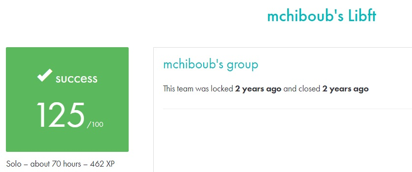

# LIBFT #

##What the project does:##
This project, Libft, is about creating a personal C library. It involves coding general-purpose functions that mimic standard C library functions and additional utility functions. These functions can be reused in future projects, serving as a foundation for more complex programming tasks.

##Why the project is useful:##
Libft is useful because it helps you understand the implementation of essential C functions and equips you with a customized set of tools to streamline future programming assignments. This library will save time and effort by allowing you to reuse functions across various projects.

[Subject of this project](en.subject.pdf)